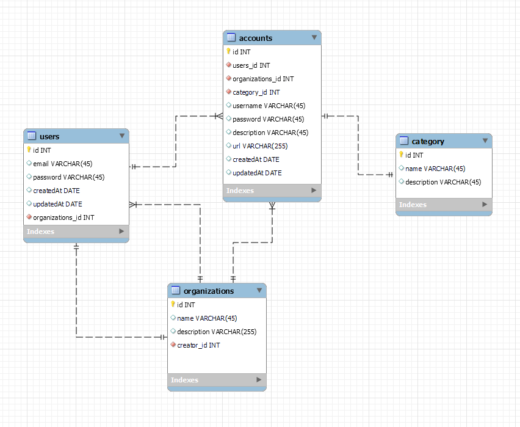

# THIS FOLDER CONTAINS ALL THE DOCUMENTATIONS OF THIS PROJECT

### A storage system for passwords for organzations. An organization, like Lighthouse labs, has many different accounts which need to be shared between users. This app will let an authorized user acess all the passwords of the organization. The app will also let a user generate a new password for a specific account (just like LastPass). Users will be able to generate a password based on the options the form will provide. Some of the options are: password length, contains lowercase, contairs uppercase, contains numbers, and contains symbols.

### If a user needs to log in to a specific website (e.g. Facebook) they can go into the app, find the appropriate password, click a button which copies the password into the clipboard, and log in.

## Requirements:

- [ ] user can register/login and be assigned to an organization

- [ ] an organization has many users

- [ ] user can add a new username and password for a specific website

- [ ] app can generate passwords based on the criteria specified (password length, contains lowercase, contairs uppercase, contains numbers, etc)

- [ ] user can edit and change their password any time

- [ ] user has a convinient copy to clipboard button so they dont have to select the password

- [ ] sites can be categoried, to, social (fb, linkedin), work related (bamboo, harvest), entertainment (snapchat, reddit), etc, etc

- [ ] For this app, it is ok to store the passwords as string but remember that this is not the way for production apps! As a stretch feature, consider storing a masterkey, which is used to encrypt each and de-encrypt incoming information from the server to the client. Reading into what salting is for passwords will be the first step for this stretch.

## ERD



```
psql
CREATE DATABASE midterm;
\c midterm
\i ./db/migrations/schema.sql
\i ./db/seeds/seeds.sql
```

## Wireframes

## SQL Queries

## Designs
