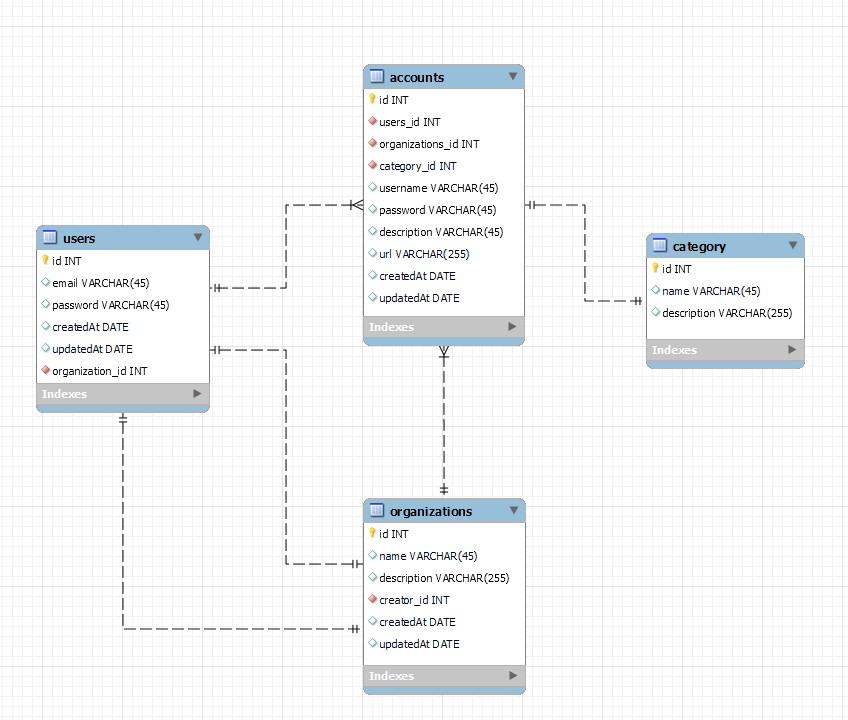
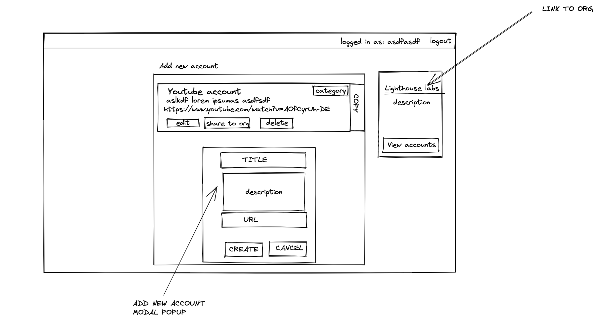

# THIS FOLDER CONTAINS ALL THE DOCUMENTATIONS OF THIS PROJECT

### A storage system for passwords for organzations. An organization, like Lighthouse labs, has many different accounts which need to be shared between users. This app will let an authorized user acess all the passwords of the organization. The app will also let a user generate a new password for a specific account (just like LastPass). Users will be able to generate a password based on the options the form will provide. Some of the options are: password length, contains lowercase, contairs uppercase, contains numbers, and contains symbols.

### If a user needs to log in to a specific website (e.g. Facebook) they can go into the app, find the appropriate password, click a button which copies the password into the clipboard, and log in.

## Requirements:

- [ ] user can register/login and be assigned to an organization

- [ ] an organization has many users

- [ ] user can add a new username and password for a specific website

- [ ] app can generate passwords based on the criteria specified (password length, contains lowercase, contairs uppercase, contains numbers, etc)

- [ ] user can edit and change their password any time

- [ ] user has a convinient copy to clipboard button so they dont have to select the password

- [ ] sites can be categoried, to, social (fb, linkedin), work related (bamboo, harvest), entertainment (snapchat, reddit), etc, etc

- [ ] For this app, it is ok to store the passwords as string but remember that this is not the way for production apps! As a stretch feature, consider storing a masterkey, which is used to encrypt each and de-encrypt incoming information from the server to the client. Reading into what salting is for passwords will be the first step for this stretch.

## ERD



```sql
psql
CREATE DATABASE midterm;
\c midterm
\i ./db/migrations/schema.sql
\i ./db/seeds/seeds.sql
// CHANGE YOUR .env to match your local username and password
```

## Wireframes



## SQL Queries

```sql
DROP TABLE IF EXISTS users CASCADE;
DROP TABLE IF EXISTS organizations CASCADE;
DROP TABLE IF EXISTS user_organizations CASCADE;
DROP TABLE IF EXISTS accounts CASCADE;
DROP TABLE IF EXISTS category CASCADE;

CREATE TABLE users (
  id SERIAL PRIMARY KEY NOT NULL,
  email VARCHAR(255) NOT NULL,
  password VARCHAR(255) NOT NULL,
  organization_id INTEGER REFERENCES organizations(id) ON DELETE CASCADE,
  createdAt DATETIME DEFAULT CURRENT_TIMESTAMP,
  updatedAt DATETIME DEFAULT CURRENT_TIMESTAMP ON UPDATE CURRENT_TIMESTAMP
);

CREATE TABLE organizations (
  id SERIAL PRIMARY KEY NOT NULL,
  name VARCHAR(255) NOT NULL,
  description VARCHAR(255) NOT NULL,
  creator_id INTEGER REFERENCES users(id) ON DELETE CASCADE,
  createdAt DATETIME DEFAULT CURRENT_TIMESTAMP,
  updatedAt DATETIME DEFAULT CURRENT_TIMESTAMP ON UPDATE CURRENT_TIMESTAMP
);

CREATE TABLE accounts (
  id SERIAL PRIMARY KEY NOT NULL,
  user_id INTEGER REFERENCES users(id) ON DELETE CASCADE,
  organization_id INTEGER REFERENCES organizations(id) ON DELETE CASCADE,
  category_id INTEGER REFERENCES category(id) ON DELETE CASCADE,
  name VARCHAR(255) NOT NULL,
  description VARCHAR(255) NOT NULL,
  url VARCHAR(255) NOT NULL,
  username VARCHAR(255) NOT NULL,
  password VARCHAR(255) NOT NULL,
  createdAt DATETIME DEFAULT CURRENT_TIMESTAMP,
  updatedAt DATETIME DEFAULT CURRENT_TIMESTAMP ON UPDATE CURRENT_TIMESTAMP
);

CREATE TABLE category (
  id SERIAL PRIMARY KEY NOT NULL,
  name VARCHAR(255) NOT NULL,
  description VARCHAR(255) NOT NULL
);

INSERT INTO users (email, password) VALUES
('randomguyfromcaainsurance@caa.com', 'IloveInsurance'),
('sandwichartist@subway.com', 'FootlongMeatball'),
('timmy@timhortons.ca', 'doubleDoublePlease'),
('winwin@winners.ca', 'hellYeahSir'),
('szym40@bookez.site', 'railroad25'),
('paimuchin@hanzganteng.tk', 'helldsakfjeahSir'),
('whoareyou@gymshark.ca', 'steroidBoy');

INSERT INTO category (name, description) VALUES
('Social', 'Social Media (eg. Facebook, Twitter, Instagram, etc)'),
('Work', 'Work Related'),
('Entertainment', 'Entertainment (eg. Youtube, Netflix, etc)');
```

## Designs
